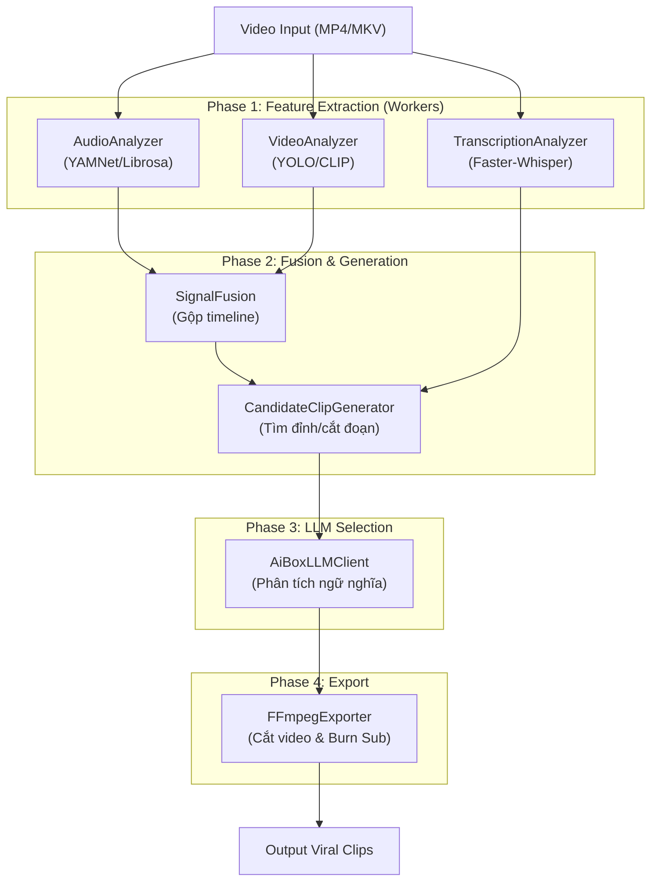

# Kiến trúc dự án Prompt2Clip

Tài liệu này cung cấp cái nhìn tổng quan về cách hệ thống Prompt2Clip hoạt động, luồng dữ liệu (pipeline) và các thành phần chính để hỗ trợ việc bảo trì và nâng cấp.

## 1. Luồng dữ liệu (Pipeline Flow)

Dự án sử dụng kiến trúc Pipeline và Adapter Pattern. Dữ liệu đi từ input video thô qua các giai đoạn trích xuất, kết hợp và chọn lọc để ra các clip hay nhất.

## 2. Tổ chức mã nguồn

Code được tổ chức theo nguyên tắc Separation of Concerns (Phân tách mối quan tâm):
- **Giao diện (UI)** nằm ở `src/ui/`.
- **Logic điều phối (Core)** nằm ở `src/core/`.
- **Logic trích xuất/AI** nằm ở `src/analyzers/` và `src/features/`.
- **Tính toán nặng** (đòi hỏi GPU/thư viện riêng) được chạy qua các sub-process trong thư mục `workers/` bằng Conda.

## 3. Câu hỏi thường gặp cho Developer (FAQ)

| Muốn làm gì? | File/Thư mục cần sửa | Ghi chú |
|---|---|---|
| **Thêm đặc trưng (feature) âm thanh mới** | `src/features/` | Tạo file mới, kế thừa `BaseFeatureExtractor`. |
| **Thêm đặc trưng hình ảnh mới** | `src/features/` | Tạo file mới, kế thừa `BaseFeatureExtractor`. |
| **Thay đổi cách tính tổng điểm (Score)** | `src/analyzers/` | Sửa logic combine trong các analyzer tương ứng. |
| **Đổi mô hình AI (OpenAI, Anthropic, v.v.)** | `src/llm/` | Tạo client mới kế thừa `BaseLLMClient`. |
| **Chỉnh sửa giao diện PyQt5** | `src/ui/app.py` | Toàn bộ giao diện desktop nằm ở đây. |
| **Đổi trọng số Video/Audio mặc định** | `src/config/settings.py` | Sửa class `AppSettings`. |
| **Thêm môi trường / Thư viện mới** | `requirements/` và `setup/` | Cập nhật file `.txt` tương ứng và script setup. |
